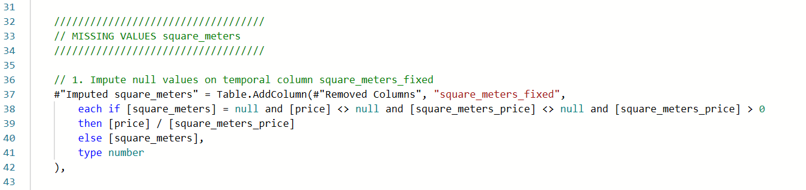
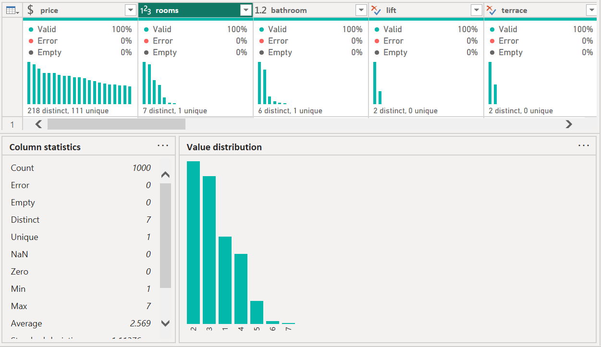

# 1. **Problem Definition**: 
- Project for predictive modeling of housing prices in Barcelona
- Project goal is to **improve the accuracy of the predictive model and provide interactive visualizations**
- Data Science project will be developed following the Data Science Life Cycle (DSLC) framework, exploring and concluding about POWERBI tool apabilities, advantages and limitations to support a data science project
- As the problem aims to predict housing prices in Barcelona, a brief complementary information about property types (as named in data) is included as reference.
    - **Study (Estudio)**: Typically the smallest type of dwelling, a studio is a single open space that combines the living area, bedroom, and kitchen, with a separate bathroom. These are ideal for individuals or couples seeking a compact living space.
    - **Attic (Ático)**: An attic refers to a top-floor apartment, often featuring sloped ceilings and sometimes including a terrace. The size can vary, but attics are generally larger than studios and may offer unique architectural features.
    - **Apartment (Apartamento)**: In Spain, the term "apartamento" usually denotes a modest-sized dwelling, typically with one or two bedrooms. These are suitable for small families or individuals desiring separate living and sleeping areas.
    - **Flat (Piso)**: The term "piso" is commonly used to describe larger residential units, often with multiple bedrooms and ample living space. Flats are prevalent in urban areas and cater to families or individuals seeking more spacious accommodations.
- Data Description
    - **price**: The price of the real-state.
    - **rooms**: Number of rooms.
    - **bathroom**: Number of bathrooms.
    - **lift**: whether a building has an elevator (also known as a lift in some regions) or not
    - **terrace**: If it has a terrace or not.
    - **square_meters**: Number of square meters.
    - **real_state**: Kind of real-state.
    - **neighborhood**: Neighborhood
    - **square_meters_price**: Price of the square meter

# 2. **Data Collection**: 
- PowerBI allows direct connectivity to multiple data sources including databases, web services, files, and cloud platforms
- Power Query Editor for data transformation, cleaning, and reshaping
- Noted Power Query first and automatic data transformation was "Changed Type" and this transformation might lead to issues
- On this data set with only 9 columns is simple to check all data types, and was found  decimal numbers as whole numbers and booleans as text.

# 3. **Data Preparation**
### **Data Overview**
- Used built-in data profiling tools to identify quality issues, providing same information as python's .dtypes .info() and .nunique() methods.


- The variable 'Unnamed' represent index and should be deleted from data
- Target variable for modeling is "price"
- There are 16376 rows and 10 columns.
- There are missing data (NaN) on multiple variables
<table>
<tr>
<td style="width: 50%;"></td>
<td></td>
<td></td>
</tr>
</table>
-  Units size goes from 10m2 to 679m2, with a mean of 84.36m2
<div style="text-align: center;">
    
</div>

- Units prices goes from 320EUR to 15000EUR/month, with mean of 1437EUR/month
- price range is assumed referred to monthly rent, so considered as EUR per month
- Units prices by square meter goes from 4.549EUR/m2/month to 197.272EUR/m2/month, with mean of 17.73EUR/m2/month
- There are units listed with cero rooms and 10.754 rooms
- There are units with 0.9 bathroom
- There are four types of real states being the most common "flat"
- Most units do not have terrace
- Most units do have lift
- The neighborhood with largest unit count is "Eixample"
- The variable 'rooms' will require feature engineering due Decimal Numbers
- The variable 'bathroom' will require feature engineering due Decimal Numbers
- There are no duplicated observations

- PowerQuery's DataPreview functions allows data visualization on column basis. For large datasets should be considered python methods such as .describe() providing DataPreview information on table basis

### **Missing Value handling**
- 389 out of 408 missing "square_meters" values are imputed considering relation "price" / "square_meters_price"
- For the step above, the Power Query M code for the equivalent Pandas logic in python can be written using Table.AddColumn and Table.ReplaceValue:


- 420 out of 439 missing "square_meters_price" values are imputed considering relation "price" / "square_meters"

- There are 19 properties missing values on both "square_meters" and "square_meters_price"
- 19 missing "square_meters_price" values are imputed with the most relevant mean based on the "real_state" and "neighborhood".

- 19 missing "square_meters" values are imputed considering relation "price" / "square_meters_price"

- Imputed missing "real_state" values by filling them with the most common (mode) "real_state" for each "neighborhood".


- 408 missing "rooms" values are imputed with the most relevant median based on the "real_state" and "neighborhood".

- 387 missing "bathroom" values are imputed with the most relevant median based on the "real_state" and "neighborhood".

### **Feature engineering**
- Removed the variable 
"Unnamed: 0" which had no value for modeling

- Transformed the values of "rooms" and "bathroom" into an integer using the following logic:
    - Values under 1 → Set to 1
    - Values 1 or above → Round to the nearest integer
    
    
    

- Variables "rooms" and "bathroom" set as integer



### **Outliers detection and treatment**
- Tried to apply the Z-score method to remove outliers with more than 3 standard deviations.
- script was computing resource hungry and after several minutes processing was force halted.
- Outliers handling recommended to be done in Power BI


### **Data Management**
- Data procesing in PowerQuery adds several auxiliary columns at table's end
- Before analysis in PowerBI recommended to drop auxiliary columns, rename as required, and reorder as in the original dataset


# 4.Theoreticals Notes
- Following notes are theoreticals and not reflected on .pbix file

## 4. Exploratory Data Analysis

**Capabilities:**
- Rich visualization library with 30+ built-in visuals
- Custom visuals marketplace for specialized chart types
- Quick Insights feature for automated pattern detection
- Cross-filtering and drill-through for interactive exploration

**Advantages:**
- Intuitive drag-and-drop interface for rapid visualization
- Built-in statistical functions for basic analysis
- Strong geospatial visualization capabilities
- Real-time filtering and slicing for interactive data exploration

**Limitations:**
- Less flexibility for advanced statistical analysis compared to R or Python
- Limited machine learning visualization options
- Cannot easily create custom algorithmic visualizations
- Visualization customization options more limited than specialized tools like Tableau

## 5&6. Modeling & Evaluation

**Capabilities:**
- DAX (Data Analysis Expressions) for creating calculated measures and columns
- Quick Measures for common calculations
- Integration with Azure Machine Learning
- Power BI Premium includes AutoML capabilities

**Advantages:**
- DAX provides powerful business logic implementation
- Time intelligence functions for trend analysis
- Integration with R and Python scripts for advanced modeling
- Key influencers visual for basic causal analysis

**Limitations:**
- Not designed for complex machine learning model development
- Limited model validation and evaluation tools
- Lack of native support for advanced statistical methods
- Less suitable for deep learning or specialized algorithms

## 7-9. Deployment & Communication

**Capabilities:**
- Power BI Service for cloud publishing and sharing
- Report embedding in applications and websites
- Mobile optimization for on-the-go insights
- Email subscriptions and alerts for automated reporting

**Advantages:**
- Enterprise-grade security and governance
- Seamless collaboration features with commenting and annotations
- Natural language Q&A for non-technical users
- Paginated reports for formal documentation

**Limitations:**
- Full functionality requires Premium licensing for larger deployments
- Less customizable than dedicated web development for embedded analytics
- Version control and development lifecycle management less mature than software development tools
- Performance can degrade with highly complex reports or large user bases

## Conclusions
In summary, Power BI excels as a business intelligence platform with strong data preparation and visualization capabilities, making it suitable for many data science projects, particularly those focused on business analytics. However, data scientists working on advanced statistical modeling, unstructured data analysis, or specialized machine learning applications may need to supplement Power BI with more specialized tools like Python, R, or dedicated ML platforms.

# 5. Perplexity ai Research 

## Exploratory Data Analysis in Power BI: Replicating and Enhancing Python-Based Insights

The transition from Python-based Exploratory Data Analysis (EDA) to Power BI presents both opportunities and challenges in data science workflows. This report evaluates the feasibility of replicating the described Python EDA process in Power BI, assesses whether similar conclusions can be drawn, and identifies potential improvements.  

## Replicating Python EDA Functionality in Power BI  

### **Univariate Analysis**  
Power BI natively supports univariate analysis through its visualization pane:  

1. **Numerical Variables**:  
   - **Histograms**: Created using the "Column chart" visualization with bins configured via the "Axis" field settings. Outlier detection can be automated using DAX measures calculating Interquartile Ranges (IQRs)[2][6].  
   - **Boxplots**: Power BI’s built-in boxplot visualization automatically displays median, quartiles, and outliers. For example, the right skew in `square_meters_price` observed in the Python analysis can be visually confirmed[1][6].  

2. **Categorical Variables**:  
   - **Countplots**: Achieved using "Bar charts" with categorical dimensions. The 85.5% dominance of "flat" property types and neighborhood concentration trends are easily identifiable[1][7].  

**Key Difference**: While Python’s `univariate_numerical()` and `univariate_categorical()` functions automate plot generation, Power BI requires manual configuration for each variable. However, reusable templates can mitigate this[2][6].  

---

### **Bivariate and Multivariate Analysis**  

1. **Cross-Tabulations**:  
   - Power BI’s "Matrix" visualization replicates `plot_crosstab_bar_count()`, displaying counts (e.g., 3,544 flats in Eixample). Conditional formatting adds heatmap functionality akin to `plot_crosstab_heat_perc()`[2][7].  

2. **Correlation Analysis**:  
   - The lack of high correlations (>75%) reported in the Python EDA can be validated using:  
     - **Scatterplot Matrices**: Configured via the “Analytics” pane.  
     - **DAX Measures**: Pearson/Spearman correlations calculated using `CORREL()`[6][7].  

3. **Grouped Comparisons**:  
   - **Side-by-Side Boxplots**: Power BI’s boxplot visual supports grouping by categorical variables (e.g., `real_state`). The lower `square_meters_price` for flats versus apartments aligns with Python findings[1][4].  

---

### **Data Preparation and Outlier Handling**  
Power BI’s Power Query Editor mirrors Python’s preprocessing steps:  

1. **Outlier Capping**:  
   - Applied via `if [Value] > UpperFence then UpperFence else [Value]` in Power Query. This replicates the capping logic used to transform `rooms` from float to integer[1][4].  

2. **Skewness Mitigation**:  
   - While Power BI lacks native Yeo-Johnson transformation, Python scripts can be embedded via “Run Python script” in Power Query, enabling advanced preprocessing[3][5].  

---

## Advantages of Power BI for EDA  

### **Interactive Data Exploration**  
Power BI’s “Explore” feature (Figure 1) allows ad-hoc pivoting and filtering, surpassing static Python plots. For instance:  
- Users can dynamically compare `price` distributions across neighborhoods using slicers[2][6].  
- Drill-downs into specific categories (e.g., “flats with terraces”) provide immediate insights without rewriting code[2][7].  

```python  
# Embedded Python script for advanced transformations  
import pandas as pd  
dataset = pd.DataFrame(dataset)  
dataset['log_price'] = np.log(dataset['price'])  
```

*Figure 1: Power BI Explore interface for rapid ad-hoc analysis[2].*  

### **Integration with Machine Learning**  
While Power BI isn’t a full ML platform, it complements Python models:  
- **Model Output Visualization**: Predictions from Python-trained models (e.g., Random Forest) can be ingested into Power BI for interactive dashboards[1][4].  
- **AutoML Integration**: Azure Machine Learning models can be deployed directly, enabling metrics like R² scores to be tracked in real-time[4][7].  

---

## Limitations and Workarounds  

### **Advanced Statistical Testing**  
Power BI lacks native support for hypothesis tests (e.g., ANOVA). Workarounds include:  
- **Python/R Scripts**: Embedded code chunks for p-value calculations[3][5].  
- **Custom Visuals**: Third-party visuals like “Histogram with Statistical Tests” from AppSource[6].  

### **Automation and Scalability**  
- **Manual Effort**: Recreating Python’s automated EDA functions requires DAX measure suites or PowerShell scripting for batch processing[5][7].  
- **Performance**: Large datasets (>10M rows) may slow down Power BI, necessitating DirectQuery mode or aggregations[2][6].  

---

## Enhancing Results with Power BI  

### **Real-Time Data Interaction**  
Stakeholders can manipulate filters to test hypotheses:  
- **Example**: Adjusting outlier thresholds (e.g., 3σ vs. IQR) and immediately observing impacts on `square_meters` distributions[2][4].  

### **Collaboration and Sharing**  
Power BI Service enables:  
- **Centralized Dashboards**: Teams access the same EDA insights via web/mobile apps, avoiding version control issues common in Jupyter notebooks[1][7].  
- **Data Alerts**: Notifications trigger when metrics (e.g., neighborhood price variances) exceed thresholds[6].  

### **Augmented Analytics**  
Power BI’s AI Insights add-on provides:  
- **Smart Narratives**: Auto-generated summaries like “Top 3 neighborhoods by price are Sarrià-Sant Gervasi, Eixample, and Les Corts”[2][7].  
- **Q&A Natural Language**: Users query data verbally (e.g., “Show price vs. square meters for flats”)[2].  

---

## Conclusion  

Power BI can replicate the core EDA findings from the Python workflow, albeit with trade-offs in automation versus interactivity. Key conclusions:  

1. **Feasibility**:  
   - Univariate/bivariate analyses and data preprocessing are achievable via Power Query and DAX.  
   - Advanced statistics require Python/R integration or third-party tools.  

2. **Improvements**:  
   - **Stakeholder Engagement**: Interactive dashboards facilitate deeper exploration than static reports.  
   - **Real-Time Monitoring**: Live data connections enable continuous EDA, unlike batch Python scripts.  

3. **Recommendations**:  
   - Use Power BI for visualization and preliminary analysis, paired with Python for complex transformations.  
   - Leverage Power BI’s “Explore” and AI features to democratize data access across teams.  

This hybrid approach balances efficiency and flexibility, enhancing reproducibility while capitalizing on Power BI’s strengths in user engagement[1][2][6][7].

Citations:
[1] https://www.reddit.com/r/PowerBI/comments/xvffu0/can_power_bi_be_used_for_data_science/
[2] https://www.element61.be/en/resource/data-exploration-made-easy-power-bi-explore
[3] https://www.youtube.com/watch?v=WZ9RDyN-brM
[4] https://www.projectpro.io/article/power-bi-microsoft-projects-examples-and-ideas-for-practice/533
[5] https://blog.crossjoin.co.uk/2023/03/23/data-wrangler-a-power-query-like-experience-for-python-people/
[6] https://www.youtube.com/watch?v=kOmFTOLGiug
[7] https://www.planeks.net/python-vs-power-bi-for-dashboards/
[8] https://www.datakwery.com/datacamp/eda-in-power-bi/
[9] https://learn.microsoft.com/en-us/power-bi/consumer/explore-data-service
[10] https://www.epiusers.help/t/power-bi-vs-eda/103732
[11] https://www.reddit.com/r/PowerBI/comments/1hr38zn/end_to_end_data_analysis_project/
[12] https://www.youtube.com/watch?v=jxugFpmS22c
[13] https://dev.to/s_ndichu/understanding-your-data-the-essentials-of-exploratory-data-analysis-eda-1hh7
[14] https://www.youtube.com/watch?v=qWllfRA5IkU
[15] https://www.youtube.com/watch?v=wCnNu7HiFvk
[16] https://www.youtube.com/watch?v=5LC4XLxVJzI
[17] https://www.youtube.com/watch?v=iGUqad1eNtQ
[18] https://www.datacamp.com/courses/exploratory-data-analysis-in-power-bi
[19] https://www.red-gate.com/simple-talk/databases/sql-server/bi-sql-server/datamarts-and-exploratory-analysis-using-power-bi/
[20] https://www.reddit.com/r/datascience/comments/11qtyh2/power_bi_or_visualization_in_python/
[21] https://www.datacamp.com/blog/8-power-bi-projects-to-develop-your-skills
[22] https://pfactorial.ai/blogs/exploratory-data-analysis-in-power-bi
[23] https://www.linkedin.com/pulse/exploratory-data-analysis-powerbi-ntale-marvin-frost
[24] https://www.kaggle.com/getting-started/307460
[25] https://www.dataquest.io/blog/power-bi-projects/
[26] https://www.linkedin.com/pulse/future-predictive-analytics-guide-power-bi-python-alham-o-hotaki-k4n9e
[27] https://www.researchgate.net/publication/364170368_COMPARING_TOOLS_PROVIDED_BY_PYTHON_AND_R_FOR_EXPLORATORY_DATA_ANALYSIS
[28] https://www.reddit.com/r/PowerBI/comments/1d0mgfo/is_power_bi_only_best_for_eda_and_descriptive/
[29] https://www.linkedin.com/posts/bbkjfr_i-always-wanted-to-use-python-in-power-bi-activity-7196419354563874819-bNFg
[30] https://www.youtube.com/watch?v=g4sTlu_B_T4
[31] https://docs.kanaries.net/es/articles/power-bi-alternatives
[32] https://es.fiverr.com/asadgul6767/be-your-data-analyst?pckg_id=1&pos=3&imp_id=367d46b9-0832-4450-9be4-11f2bff94750