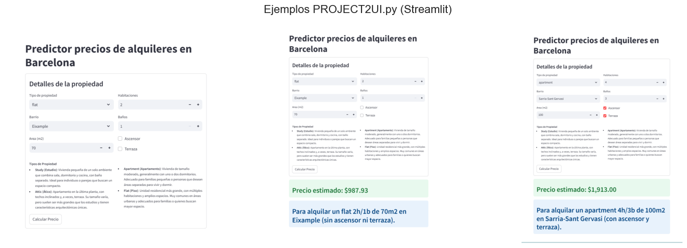

# 1. **Problem Definition**: 
- Project for predictive modeling of housing prices in Barcelona
- Project goal is to **improve the accuracy of the predictive model and provide interactive visualizations**
- Data Science project will be developed following the Data Science Life Cycle (DSLC) framework

# 2. **Data Collection**: 
- Dataset provided by the academy
- The option of improving data using WebScraping was explored
- Attempts at self-learning were reflected in python programs "scraper_fotocasa.ipynb" and "scraper_v2.ipnb"
- Programs aimed to browse the fotocasa website and collect information following the format of the dataset provided by the academy.
- The programs were not completed, they are not functional in any version. Development of the programs was stopped on academic recommendation.
- Web scraping can raise legal and ethical considerations, especially if it involves accessing data without authorization or violating a website's terms of service.
- The academy recommended requesting permission from the web portal before continuing with development.
- The related links were read (https://www.fotocasa.es/es/politica-privacidad/p ; https://www.fotocasa.es/es/aviso-legal/cp ; https://www.fotocasa.es/es/aviso-legal/ln) and no explicit information was found regarding the authorization or prohibition of web scraping activities. 
- It is noted that the absence of explicit permission does not imply consent.
- Permission was requested from the portal and a negative response was received
- The project will consider the data provided by the academy
- Web scraping involves automatically extracting data from websites, which can be subject to legal restrictions depending on the website's policies and applicable laws.
- As the problem aims to predict housing prices in Barcelona, a brief complementary information about property types in Spain is included as reference.
    - **Studio (Estudio)**: Typically the smallest type of dwelling, a studio is a single open space that combines the living area, bedroom, and kitchen, with a separate bathroom. These are ideal for individuals or couples seeking a compact living space.
    - **Attic (Ático)**: An attic refers to a top-floor apartment, often featuring sloped ceilings and sometimes including a terrace. The size can vary, but attics are generally larger than studios and may offer unique architectural features.
    - **Apartment (Apartamento)**: In Spain, the term "apartamento" usually denotes a modest-sized dwelling, typically with one or two bedrooms. These are suitable for small families or individuals desiring separate living and sleeping areas.
    - **Flat (Piso)**: The term "piso" is commonly used to describe larger residential units, often with multiple bedrooms and ample living space. Flats are prevalent in urban areas and cater to families or individuals seeking more spacious accommodations.

# 3. **Data Preparation**: 
### **Data Overview**
- The variable 'Unnamed' represent index and should be deleted from data
- Target variable for modeling is "price"
- There are 16376 rows and 10 columns. 
- Project1 data had 8188 rows and 10 columns.
- Data types are aligned with information, except variables 'rooms' and 'bathroom' being float and expected integer
- There are missing data (NaN) on multiple variables
- Units size goes from 10m2 to 679m2, with a mean of 84.36m2
- Units prices goes from 320EUR to 15000EUR/month, with mean of 1437EUR/month
- price range is assumed referred to monthly rent, so considered as EUR per month
- Units prices by square meter goes from 4.549EUR/m2/month to 197.272EUR/m2/month, with mean of 17.73EUR/m2/month
- There are units listed with cero rooms and 10.754 rooms
- There are units with 0.9 bathroom
- There are four types of real states being the most common "flat"
- Most units do not have terrace
- Most units do have lift
- The neighborhood with largest unit count is "Eixample"
- The variable 'rooms' will require feature engineering
- The variable 'bathroom' will require feature engineering
- The total number of observations with an integer number for variable "rooms" is 8000, this represents 48.85% of total observations
- The total number of observations with an integer number for variable "bathroom" is 8210, this represents 50.13% of total observations
- Considering high proportion of invalid values (not integer) on variables 'rooms' and 'bathroom' (51.15% and 49.87%), and Project2 dataset is stated as an augmented version of Project1 dataset, is interpreted Project1 dataset was augmented adding artificial data to make it larger, and in this process of **Data Augmentation** those observations with decimal values where not corrected to integers into Project2 dataset.
- There are no duplicated observations

### **Missing Value handling**
- 389 out of 408 missing "square_meters" values are imputed considering relation "price" / "square_meters_price"
- 420 out of 439 missing "square_meters_price" values are imputed considering relation "price" / "square_meters"
- There are 19 properties missing values on both "square_meters" and "square_meters_price"
- 19 missing "square_meters_price" values are imputed with the most relevant mean based on the "real_state" and "neighborhood".
- 19 missing "square_meters" values are imputed considering relation "price" / "square_meters_price"
- Imputed missing "real_state" values by filling them with the most common (mode) "real_state" for each "neighborhood".
- 408 missing "rooms" values are imputed with the most relevant median based on the "real_state" and "neighborhood".
- 387 missing "bathroom" values are imputed with the most relevant median based on the "real_state" and "neighborhood".

### **Feature engineering**
- Removed the variable 
"Unnamed: 0" which had no value for modeling
- Transformed the values of "rooms" and "bathroom" into an integer using the following logic:
    - Values under 1 → Set to 1
    - Values 1 or above → Round to the nearest integer
- Variables "rooms" and "bathroom" set as integer

### **Outliers detection and treatment**
- Applied the Z-score method, which removes outliers with more than 2 standard deviations.
- Some variables with a relevant percentage of outliers still remain. df5_shape:(14269, 9)
- Limiting outliers at whiskers (winsorization) is considered due to the nature of the data
- Applying winsorization can hide valuable trends in luxury or budget properties, but in this case the extreme prices are assumed to be errors or anomalies in the synthetic or augmented data, so applying winsorization will make the model more robust to those outliers.

### **Data Management**
- **'df_ORIGINAL_DATA.csv'**: Reference dataset as a copy of original data. 
- **'df_MISSING_DATA.csv'**: Data subset filtered by missing value data. 
- **'df2_IMPUTED_DATA.csv'**: Updated dataset after the imputation of the missing values. 
- **'df3_WRONG FEATURES_DATA.csv'**: Data subset filtered by data subject to feature engineering.
- **'df3_FEATURE ENGINEERED_DATA.csv'**: Updated dataset after feature engineering.
- **'df6_WITHOUT OUTLIERS_DATA.csv'**: Updated dataset after handling outliers

# 4. **Exploratory Data Analysis (EDA)**:
### **Functions**
- univariate_numerical(data): Function to generate two plots for each numerical variable. Histplot for variable distribution. Boxplot for statistical summary
- univariate_categorical(data): Function to generate countplot for each categorical variable. Labeled with count and percentage
- plot_crosstab_bar_count(df, var_interest): Function to create a barplot of crosstab of the variable of interest vs each of the rest of categorical variables. Labeled with counts
- plot_crosstab_heat_perc(df, var_interest): Function to create a heatmap of crosstab of the variable of interest vs each of the rest of catagorical variables. Labeled with counts, percentage by row, percentage by column
- boxplot_by_group(df, group, var, outliers): boxplot for a numerical variable of interest vs a categorical variable. with or without outliers. includes data mean and mean by category
- side_by_side_boxplot(df1, df2, group, var, outliers, title1, title2): to present two side by side boxplot_by_group

### **Univariate Analysis**
- 'price', 'square_meters' and 'square_meters_price' variables are right skewed and reflect the effect of capping outliers to upper whysker.
- Comparing original data (df) vs. prepared data (df6) is noticeable how in original data the numerical variables have float type values and many outliers, while in prepared data the numerical variables have integer values and no outliers.
- In the prepared data there are flats units with 4 rooms and 135m2 area.
- In the original data there are flats units with 10.754 rooms and 679m2 area.
- The "large flats" units in the data are asummed as unreal/not-valid data and are affected by Data Preparation.
- The categorical variables are not balanced, with 85.5% of properties as "flats" and 78.5% of units concentrated in 50% of the sample neighbourhoods
- 75% of flats units have up to 3 bedrooms and up to 2 bathrooms with an average size of 85.48m2.
- 75% of the units in Eixample have up to 3 bedrooms and up to 2 bathrooms with an average size of 80.21m2.

### **Bivariate Analysis**
- There are no couple of variables with high correlation (>75%)
- Top 3 neighborhood by price mean value are: Sarria-Sant Gervasi,Eixample,Les Corts
- Top 3 neighborhood by square_meters mean value are: Sarria-Sant Gervasi,Les Corts,Eixample
- Top 3 neighborhood by square_meters_price mean value are: Ciutat Vella,Sarria-Sant Gervasi,Eixample
- Top 3 real_state by price mean value are: apartment,attic,flat
- Top 3 real_state by square_meters mean value are: flat,attic,apartment
- Top 3 real_state by square_meters_price mean value are: apartment,study,attic
- From the perspective of price per square meter, the most attractive type of unit according to this data could be the **flat**, with an average surface area of ​74.62 m2 (just over the average 73.41 m2) and a price per square meter of 15.44 below the average (16.14)
- There are 3544 flats in Eixample, being the most popular unit type and neighborhood combination, with 85.32% of the units in Eixample being flats, and 29.05% of all flats are located at Eixample. 
- Across all neighborhoods, the unit type "flat" is the most popular with at least 85.32% of units by neighborhood
- Most types of units have a lift, in the case of flats the proportion is 71%
- Units with a terrace on the other hand, seem to be rare and very few have one

# 5. **Modeling**:
- Defined function "evaluate_model(model, x_test, y_test)", to evaluate and return the model's metrics into a results dataframe
- Defined function "evaluate_models_with_cv(models, X_train, y_train, X_test, y_test)" to evaluates multiple regression models using cross-validation and final test set performance.- Defined function "univariate_numerical_y()", to generate two plots (Histogram and Boxplot) for the numerical variable y
- Modeling data (data) will be done over a copy of prepared data (df6)
- The dataset contains numerical features with different scales, which may affect algorithms sensitive to scale.
- Several models will be tried, including models that rely on distance-based calculations (Logistic Regression, SVM, KNN) that perform better with standardized data, and also linear models (Linear/Logistic Regression, Ridge, Lasso) that can converge faster with standardized inputs.
- Due the different scales, and models to be evaluated, the data will be standarized:
    - 'price' is the target variable. Standardizing the target (y) is not necessary for most regression models
    - 'rooms' and 'bathrooms' show a discrete distribution, which has peaks at certain integer values. No scaling considered.
    - cathegorical or binary variables such as 'lift' , 'terrace', 'real_state' and 'neighborhood' do not need scaling.
    - 'square_meters' and 'square_meters_price' have right-skewed distributions and will be transformed using PowerTransformer (Yeo-Johnson) before applying StandardScaler.

# 6. **Evaluation**:
### **Regression Models**
- Models to be tested are : Linear Regression, Lasso Regression, Ridge Regression, Decision Tree, Random Forest, K-Nearest Neighbors, and Support Vector Regressor
- Performance Metrics:
    - **MAE** (Mean Absolute Error): Measures the average magnitude of errors in a set of predictions, without considering their direction.
    - **MSE** (Mean Squared Error): Measures the average of the squares of the errors, giving more weight to larger errors.
    - **RMSE** (Root Mean Squared Error): The square root of MSE, providing error in the same units as the target variable.
    - **R2 Score** (Coefficient of Determination): Indicates how well the model's predictions approximate the real data points. A value closer to 1 indicates a better fit.
- Random Forest metrics: Lowest MAE, lowest RMSE, and highest R².
- Random Forest is the best performer overall, indicating strong predictive accuracy and low error.
- Decision Tree metrics: Moderate errors with a good R².
- Decision Tree is a strong candidate, although slightly behind Random Forest.
- Ridge, Linear, and Lasso Regression metrics are consistent with each other, but their performance is noticeably lower than the tree-based methods. They might not be ideal for further tuning if the goal is the best predictive performance.
- For hyperparameter tuning and further validation, **Random Forest** and **Decision Tree stand** out as the best candidates due to their superior performance metrics.
- While the linear models (Ridge, Linear, and Lasso) can serve as strong baselines, they do not match the predictive accuracy of the tree-based models.
- K-Nearest Neighbors and SVR appear less promising for further development on this dataset.

### **Feature Engineering**
- From the feature importance plot, square_meters is the most significant variable, followed by square_meters_price.
- Since price is directly derived from square_meters * square_meters_price, including both may not add new information and could introduce redundancy.
- It makes no sence to ask end user square_meters and square_meters_price to "predict" price.
- **NEW MODELS** will be evaluated, with the feature **square_meters_price DROPED** from the data
- Although its VIF (1.568) is low (suggesting no strong collinearity within the dataset), the mathematical dependence between square_meters and square_meters_price suggests redundancy.
- This means the model could overestimate the importance of one feature over another and lead to unstable coefficient estimates.
- By keeping only square_meters, the model remains more interpretable, focusing on how space affects price rather than a derived variable.
- Noted features 'rooms' and 'bathroom' present high multicolinearity and will be also droped from modeling
- Defined function "preprocess_data(data, target_feature, drop_features, scale_features, test_size=0.30, random_state=1)", to iterate on the data preparation for modeling
- Data preparation droping the feature square_meters_price
- Linear Regression and Ridge Regression performed the best in terms of R² Score.
- Feature selection will be performed to reduce multicollinearity.
- Data preparation droping the feature 'rooms' due high multicolinearity
- After removing feature 'rooms' still Linear Regression and Ridge Regression performed the best in terms of R² Score, but also remains features with high multicolinearity
- Data preparation droping the feature 'bahtroom' due high multicolinearity
- Remains the feature real_state_flat with VIF>5
- Since "flat" is the most frequent category across neighborhoods, it might be highly correlated with certain neighborhood variables.
- Instead of removing real_state_flat, it will be considered as the Baseline Category for real_state
- Modified  preprocess_data function to control one-hot encoding category to drop
- Selected real_state_flat and neighborhood_Eixample as the base line categories for one-hot encoding
- There is no multicolinearity in the data, suggesting the real state distribution in terms of number of rooms and bathrooms is not as relevant as the real state area, type and neighborhood
- Linear Regression and Ridge Regression are the best models among those tested, but R² scores suggest that the models are not explaining a significant portion of the variance in the target variable.
- More advanced models will be included in the evaluation

### **Advanced Regression Models**
- Models to be tested are: DecisionTree_Tuned_1, RandomForest_Tuned_1, GradientBoosting_Tuned_1, XGBoost_Tuned_1, LightGBM_Tuned_1, NeuralNetwork(MLP)
- The best R2 score from the advanced models is currently 0.5450 with the Gradient Boosting model. 
- Improving from 0.5113 Linear Regression could be a good start, but could potentially be improved further with model tuning

** Model Tuning**
- After model tunning, another slight improvement was achieved
- The best R2 Score from the tuned models is currently 0.5510 with the XGBoost_Tuned_Optima model.
- The best R2 Score achieved is low, and still suggest that the models are not explaining a significant portion of the variance in the target variable.

### **Revisit**
- So far, various regression models were tested (Linear, Lasso, Ridge, Decision Tree, Random Forest, KNN).
- Feature selection and transformation steps were applied.
- Hyperparameter tuning was performed for some models (Random Forest, Gradient Boosting, XGBoost, LightGBM
- Optuna was used for advanced hyperparameter tuning.
- **Despite all this, the R² score remained low**
- In this section, a diferent approach will be tested aiming to reach better results.
- On this new approach, not all outliers will be removed.
- Only will be removed those over 3 standard deviations
- The remaining data will be considered as valid for modeling information, due it captures high areas or luxury units
- Feature selection done considering "real_state_flat" and "neighborhood_Eixample" as the base line categories for one-hot encoding
- **Polynomial features** are derived by raising existing numerical features to a power (e.g., squared, cubic) and creating interaction terms between different features. This extends the linear model to capture non-linear relationships in the data
- Adding polynomial and interaction terms can help the model learn more complex relationships between features, improving performance
- If Housing prices are influenced by complex interactions between features like square meters, number of rooms, and location, the a linear model might fail to capture these nuances.
- **Stacking** is an ensemble learning technique that combines multiple base models to make better predictions. It works in two main stages: a) Train base models independently: Several regressors (e.g., Random Forest, XGBoost, LightGBM) make individual predictions. b) Meta-model learns from base model outputs: A final estimator (often a linear model or another tree-based model) takes the predictions from the base models as inputs and learns to optimize the final prediction
- While individual models may overfit, the stacking regressor generalizes better by learning which model performs best in different scenarios
- **Achieved R2 Score 0.58**, still low
- Final aproach will be done considering Feature Engineering Enhancements like Log Transformation for Skewed Data and Polynomial & Interaction Features, Staking Modeling will be applied but testing other base models.

### **Final Modeling**
- Applyed **Log Transformation** to Reduce Skewness. This transformation helps normalize right-skewed distributions, making the data more symmetrical and better suited for linear models.
- The dataset's 'price' distribution (as seen in the histogram) is highly skewed, and many machine learning models (like linear regression and tree-based models) perform better with normally distributed data.
- Applying the log transformation reduces the effect of extreme values (e.g., luxury properties with abnormally high prices) and improves the model's ability to capture general trends.
- Decision trees (Random Forest), gradient boosting (XGBoost, LightGBM) each have unique strengths in handling structured data. **Stacking** allows leveraging multiple perspectives.
- Whit this implementation it was achieved an improved **R² Score 0.65**
- New test removing high VIF variables and variating models
- without high VIF variable "square_meters" the R2 decreased
- without high VIF variable "rooms" the R2 decreased
- without high VIF variable "bathroom" the R2 decreased
- without high VIF variables "rooms" and "bathroom" the R2 decreased
- Decided not to continue searching for model enhacements due doubts on original dataset quality.
- **Best model achieved R2 Score of 0.65**
- Best model exclude from modeling variable "square_meters_price"
- Best model process considers polinomial features, lolg transformation and stacking

# 7. **Deployment**:
- Best model achieved and related feature transformation files where saved
- Created a folder named "models" for models files saving
- Files saved with a filename that includes today's date for versioning purposes
- Model deployment code will be held on a separated Jupiter Nodebook using Stramlit
- Streamlit is a Python framework for building interactive web applications for machine learning models.
- The new file for the user interface will be named "PROJECT2_UI.py" and will load the model and build a user interface using Streamlit

# 8. **Monitoring and Maintenance**:
- Sumarized code for model testing on new data when available
- New data should be without missing values before modeling, and have to mantain features structure and naming
- A separated file named "model_retrain.py" created to run the same modeling when new data become available
- model_retrain.py outputs:

PS C:\Users\otroc\OneDrive\Documents\Carlos\IMPELIA_PEA_AIDS_PROJECT2\CarlosM> python model_retrain.py
Available CSV files:

1. DATA_Barcelona_Fotocasa_HousingPrices_Augmented.csv
2. df2_IMPUTED_DATA.csv
3. df3_FATURE ENGINEERED_DATA.csv
4. df3_WRONG FEATURES_DATA.csv
5. df6_WITHOUT OUTLIERS_DATA.csv
6. df7_MODELING_DATA.csv
7. df7_WITHOUT OUTLIERS 3SD_DATA.csv
8. df_MISSING_DATA.csv
9. df_ORIGINAL_DATA.csv
Enter the number corresponding to the CSV file: 3

Data Loaded, Feature Engineering ongoing....

Original data features: ['price', 'rooms', 'bathroom', 'lift', 'terrace', 'square_meters', 'real_state', 'neighborhood', 'square_meters_price']

Modeling data features: ['price', 'rooms', 'bathroom', 'lift', 'terrace', 'square_meters', 'square_meters_price', 'real_state_apartment', 'real_state_attic', 'real_state_study', 'neighborhood_Ciutat Vella', 'neighborhood_Gràcia', 'neighborhood_Horta- Guinardo', 'neighborhood_Les Corts', 'neighborhood_Nou Barris', 'neighborhood_Sant Andreu', 'neighborhood_Sant Martí', 'neighborhood_Sants-Montjuïc', 'neighborhood_Sarria-Sant Gervasi']

Output variable: price

Input variables: ['rooms', 'bathroom', 'lift', 'terrace', 'square_meters', 'real_state_apartment', 'real_state_attic', 'real_state_study', 'neighborhood_Ciutat Vella', 'neighborhood_Gràcia', 'neighborhood_Horta- Guinardo', 'neighborhood_Les Corts', 'neighborhood_Nou Barris', 'neighborhood_Sant Andreu', 'neighborhood_Sant Martí', 'neighborhood_Sants-Montjuïc', 'neighborhood_Sarria-Sant Gervasi']       
Feature Engineering done, Stacking modeling ongoing....

Improved R² Score: 0.6584
Models saved successfully!

# 9. **Communication and Reporting**:

- Data quality is fundamental to get optimal results.
- Considering the data quality issues (missing values and outliers) and limitations (only 10 neighbourhoods), is suggested to evaluate automated ways for data collection (i.e. web scraping) for better quality and wider data.
- The variable "square_meters_price" was not conidered for modeling, due the asumption of no modeling required to predict "price" if that variable is known together with the variable "square_meters".
- To enable the model to learn the complex relationships between features on this dataset, modeling considered:
    - Feature Engineering Enhancements
    - Log Transformation for Skewed Data
    - Polynomial & Interaction Features
    - Modeling with XGBoost, LightGBM, and Stacking
- To interact with uses, it was created a dedicated script (PEA_AIDS_PROJECT2_UI.py) that runs a **local web app** where users can input values and get predictions.
- It is important to monitor the model's performance. If required to retrain the model, this can be done by a dedicated code (model_retrain.py).
- For sharing and visualization is made available an html version of this code

